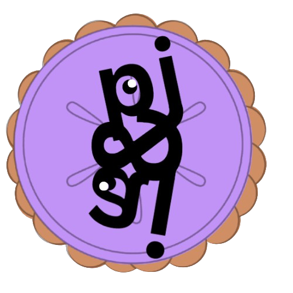
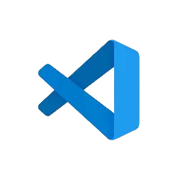
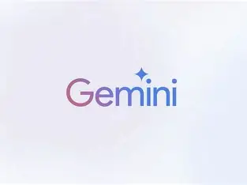
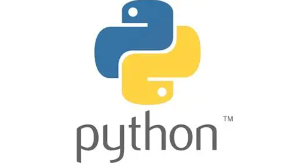

<!-- height or width of logo may be adjusted -->
<!-- This section is where you will replace the link to your transparent logo, the title of your project, and the very short desciptor of your project -->
<!-- If you used Canva to make your icon and don't want to pay for a background remover, you can use the website https://www.remove.bg/ to do so -->
<p align="center">
  
  <h1 align="center">Pi&AI</h1>
  <p align="center">A project for students to enrich their understanding in technology by  team Pi Sharp </p>
</p>
<!-- the emojis are not set in stone! If you'd like you can remove them entirely or select your own from https://gist.github.com/rxaviers/7360908 you are welcome to -->

## :loudspeaker: About
The objective of the workshop is to introduce the concept prompt engineering to students and show them how we used it to make learning technology more interactive and fun.
<!-- You can look at other TAP projects if you need a better idea of how to describe your workshops objectives -->

This workshop showcases to students on how prompt engineering is used to interact with LLMS (Large Language Models). In this workshop students will be guided through on how to make their own AI API keys and prompt engineer them to their needs.

## :bulb: Project Information
<!-- 
Your Options for target audience: 
  - High School
  - College
  - Middle School
  - K-12
  - Non-Stem
  - Undergraduate
You can select from a range of audiences or a single auidience. Examples: 
    Middle School - College 
    High School - College
    K-12
  You will be presenting most often to your peers who are taking introductory technology classes, so more often than not you should be including college in your target audience range. 
-->
* <b>Difficulty Level:</b> Beginner/Intermediate 
* <b>Target Audience:</b> Middle School - College
* <b>Duration of Workshop:</b> 20 - 25 min 
* <b>Needed Materials:</b> Keyboard, mouse, computer
* <b>Learning Outcomes:</b> The primary goal of this project is to teach participants how genertive chat bots are created and how to train data.
* <b>Your Main Technology</b> Name of Technology and then a brief descriptor. You will go more in depth on the technology used in a different section. 
* [Technology Ambassador Program](https://tapggc.org/) <b>(TAP)</b> is a project-based class that provides a collaborative environment for students to work with their fellow classmates on a semester-long project using technologies of their choice. TAP strives to increase participation in IT through numerous outreach activities and workshops that are designed to showcase the creative and fun side of technology.
<!-- Commercial Video stored in the Media folder will be linked here -->

[Commercial Video](https://github.com/TAP-GGC/NinjaTurtles/assets/157164928/94b037a6-8912-44da-8a8c-84c0b8a0afb8)

<!-- videos can also be dragged and dropped into markdown files if you want them embedded -->

## :pencil2: Team: Pi&AI

<!-- Use the team photo of your choice once youve uploaded it to the team photo folder within the media folder -->


> (From left to right: Kyla, Keyvaun, Lorena.)
<!-- replace with full names of your team members -->

* Keyvaun Herring
* Kyla Thorpe
* Lorena Salazar

## :mortar_board: Advisors
<!-- name of the two professors overseeing your TAP class -->
* Dr. Wei Jin
* Dr. Xin Xu


## :page_with_curl: Project Description
PI - AI is an study assistant Web-Based chatbot powered by the AI model Gemini. This application was specifically designed to provide users with a more interactive and engaging way to learn technological subjects through AI-generated study plans and flashcards. In addition, we used a technique called prompt engineering to ensure that Gemini explains these concepts in the most easy and friendly way possible to ensure the user understands the concept they are trying to learn. When the user opens the application, they are greeted with a welcome prompt from PI-AI , and then asked to give PI-AI a question about any technological subject. After the user gives PI-AI a question, the user will then be given a brief description on that particular subject, followed by the option to either generate a study plan or flashcards for them. If the user chooses the study plan option,  PI-AI will generate 8 tasks for them to complete. Each task will consist of a passage and two questions about that passage that the user answers. We as a team wanted to introduce prompt engineering to students to broaden their understanding of AI, so they could leverage it to their specific needs.
 
## :memo: Publications
<!-- team members, then professors/advisors. "Name of Publication", event, month and day, year, Georgia Gwinnett College. -->
1. Keyvaun Hering, Lorena Salazar, Kyla Thorpe, Wei Jin, Xin Xu. "A Real Fake Workshop", Fake Event, April 1, 2024, Georgia Gwinnett College.  

## :open_hands: Outreach
<i>List the outreach events your team has participated in. </i>

<!--Example:-->

1. <b>TAP Expo</b>, March 5, 2026, Georgia Gwinnett College: to promote the IT field and encourage college students to sign up for TAP.
2. <b> ASF </b>, March 7, Georgia Gwinnett College:
3. <b> ASF </b>, March 21, Atlanta:
4. <b> Super Saturday </b>, April 4, Georgia Gwinnett College:
   <!--<b>Class Workshops</b>, April 13-15, 2021, Georgia Gwinnett College: to promote the IT field to non-IT students.-->

## :mag_right: Similar Projects
If you're interested projects that utilize AI, check out AIDiva(https://github.com/TAP-GGC/AiDiva)!

## :computer: Technology

<!-- be sure to use the alt text feature in case anybody viewing your repo is using  screen reader! you want your workshop to be as accessible as possible 
Python, Scikit-Learn-->
<p align="center">
  
</p>

* [Python]((https://www.python.org/)) is a high level programming language designed to be easily readable and debuggable, and is one of the most widely used programming languages to build website, software, automate tasks, and analyse data.
* Python was used to system prompt our AI model and similarly acts in the workshop to demonstrate how students can train data to create their own.
* [Gemini]((https://gemini.google.com/app)) is a Large Language Model developed by Google 
* HTML, CSS, JavaScript

<p align="center">

  
   
</p>

## Project Setup/Installation

Follow the steps below to get Pi&AI running on your computer. No coding experience needed!

---

### Step 1 — Get a Gemini API Key

Pi&AI is powered by Google's Gemini AI. You will need a free API key to use it.

1. Go to [Google AI Studio](https://aistudio.google.com/apikey)
2. Sign in with a Google account
3. Click **"Create API key"** and copy the key somewhere safe

---

### Step 2 — Download the Project

1. At the top of this GitHub page, click the green **"Code"** button
2. Select **"Download ZIP"**
3. Once downloaded, **extract/unzip** the folder to your Desktop or anywhere you like

---

### Step 3 — Install Visual Studio Code (VS Code)

VS Code is a free code editor that makes it easy to view and edit project files.

1. Go to [code.visualstudio.com](https://code.visualstudio.com/)
2. Click the **Download** button for your operating system (Windows, Mac, or Linux)
3. Run the installer and follow the on-screen instructions
4. Once installed, open VS Code
5. Then open the extracted folder into the editor

**Recommended Extension:**
- Open VS Code, click the **Extensions** icon on the left sidebar (or press `Ctrl+Shift+X`)
- Search for **"Python"** and install the extension by Microsoft — this gives you syntax highlighting and makes working with the project much easier

---

### Step 4 — Install Python

If you do not already have Python installed:

1. Go to [python.org/downloads](https://www.python.org/downloads/)
2. Download and install **Python 3.8 or higher**
3. During install, check the box that says **"Add Python to PATH"**

To verify it installed correctly, open the terminal in VS Code (**Terminal → New Terminal** or press `Ctrl+` `` ` ``) and run:
```
python --version
```

---

### Step 5 — Create a Virtual Environment

A virtual environment keeps the project's packages separate from the rest of your computer. This is required before installing dependencies.

1. In VS Code, open the terminal (**Terminal → New Terminal** or press `Ctrl+` `` ` ``)
2. The terminal should already be in your project folder. If not, use **File → Open Folder** to open the extracted project folder first
3. Create the virtual environment:
   ```
   python -m venv .venv
   ```
4. Activate it:

   - **Windows:**
     ```
     .venv\Scripts\activate
     ```
   - **Mac/Linux:**
     ```
     source .venv/bin/activate
     ```

   You will know it is active when you see **`(.venv)`** at the start of your terminal line.

---

### Step 6 — Install Dependencies

With your virtual environment active, run this in the VS Code terminal:
   ```
   pip install -r backend/requirements.txt
   ```

---

### Step 7 — Add Your API Key

1. In VS Code's file explorer (left sidebar), open the **`backend`** folder
2. Right-click inside the `backend` folder and select **"New File"**, name it **`.env`**
3. Add this line to the file:
   ```
   GEMINI_API_KEY=paste_your_api_key_here
   ```
4. Replace `paste_your_api_key_here` with the key you copied in Step 1, then save the file

---

### Step 8 — Run the App

1. In the VS Code terminal, run:
   ```
   python backend/app.py
   ```
2. You should see output that includes a line like:
   ```
   Running on http://127.0.0.1:5000
   ```
3. Open your browser and go to **http://127.0.0.1:5000**

Pi&AI should now be running! Start chatting with Pi to explore tech topics, generate flashcards, and build study plans.

---

### Troubleshooting

| Problem | Fix |
|---|---|
| `python` not found | Try `python3` instead of `python` |
| `pip` not found | Try `pip3` instead of `pip` |
| API key error | Double-check your `.env` file has no extra spaces around the `=` sign |
| Port already in use | Close other terminals and try again |

## Short Demo Instructions 
[Demo Video on how to install and play our game](https://youtu.be/mA80Aa55t-U)

## Workshop Instructions 
[Click here to view workshop walkthrough pdf file](https://github.com/TAP-GGC/Pi-AI/blob/32f90cef69b056ae66814036edaa104aae08e0de/documents/workshop%20materials/TAP%20Workshop.pdf)

[Click here for the Google Collab file](https://github.com/TAP-GGC/Pi-AI/blob/10d8ab215d87ceb365741cf56a18bda1577e33db/documents/workshop%20materials/Build_Your_Own_AI_agent_Workshop(1).ipynb)

[Our Game Workshop Video](https://youtu.be/Mtsre0iMStM)


